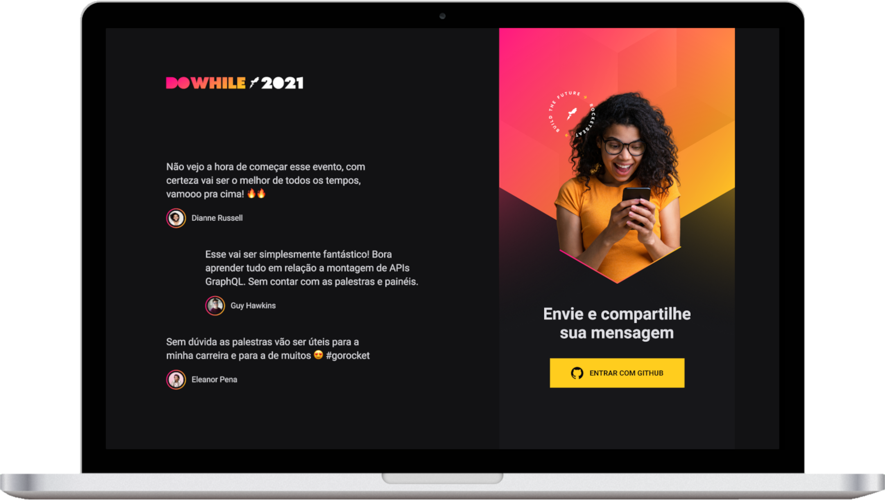

<h1 align="center">
  
</h1>

  <a href="#-technologies">Technologies</a>&nbsp;&nbsp;&nbsp;|&nbsp;&nbsp;&nbsp;
  <!-- <a href="#-project">Project</a>&nbsp;&nbsp;&nbsp;|&nbsp;&nbsp;&nbsp; -->
  <a href="#-layout">Layout</a>

 

  

## 🚀 Technologies

This project was developed with the following technologies:

- NodeJS
- Typescript
- Express
- WebSocket
- Prisma

<!-- do later
## 💻 Project
Description
- realtime
- comments
- DO While evente
-->

## 🔖 Layout

You can view the project layout through [this link](https://www.figma.com/community/file/1031699316177416916).You must have an account on [Figma](https://figma.com) to access it.

---

Made with ♥ by Rocketseat 👋 [Join our community!](https://discordapp.com/invite/gCRAFhc)